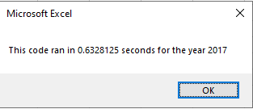
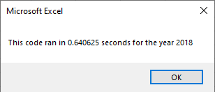
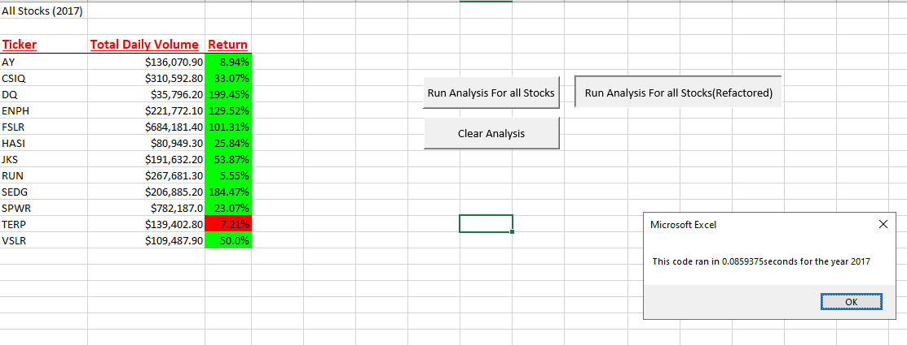
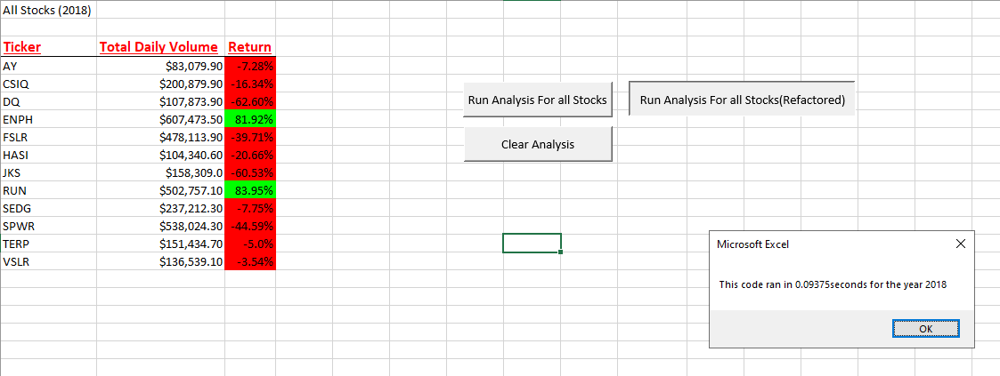

# Green Stock Analysis (2017 & 2018)

## Overview of Project
- <p>I have been asked by my friend Steve to help him with his analysis on a green stock (DAQO - DQ) for his parents to see if it is worth investing in. To do this I created an automated macro that returns the total daily volume and the annual return in a click of a button. <br>For better research purposes I added the option to expand the dataset to include all stocks of interest.</br></p>

### Purpose
- <p>The purpose of this challenge is to refactor the old code we have written into a more efficient running code that will do exactly the same as the old one, making it run smoother and faster.</p>

## Results
- <p>Run times of both 2017 & 2018 analysis pre-refactored code</p>


- <p>Data Analysis & run times for each year</p>


- <p>Comparing both years we can clearly see which stocks are worth investing in. At the time of this request there are only 2 stocks that show clear growth over the 2 years, therefore it would be a good idea to wait before making any investment. And by using this numbers, Steve can now explain to his parents which stocks are more profitable in the long run.</p>

### Explanation of the code

- Here we ask Steve which year he wants to run the analysis on:
 
    ```vb
    yearValue = InputBox("What year would you like to run the analysis on?")
    
    'Loop until year 2017 or 2018 is entered
    Do Until yearValue = "2017" Or yearValue = "2018"
    
        MsgBox "Only year 2017 or 2018 available for analysis, please try again.", vbExclamation
        yearValue = InputBox("What year would you like to run the analysis on?")
    ```
    
- Here we create an array(tickers) to store all the ticker name values. We also create a variable (tickerIndex) to help us access the correct index across the four different arrays. We also create 3 more arrays to store the total volume, starting and ending prices so we can create an yearly analysis later on:

    ```vb
    '3) Initialize array of all tickers
    Dim tickers(12) As String
    
    tickers(0) = "AY"
    tickers(1) = "CSIQ"
    tickers(2) = "DQ"
    tickers(3) = "ENPH"
    tickers(4) = "FSLR"
    tickers(5) = "HASI"
    tickers(6) = "JKS"
    tickers(7) = "RUN"
    tickers(8) = "SEDG"
    tickers(9) = "SPWR"
    tickers(10) = "TERP"
    tickers(11) = "VSLR"
    
    '4a) Activate data worksheet
    Sheets(yearValue).Activate
    
    '4b) Get the number of rows to loop over
    RowCount = Cells(Rows.Count, "A").End(xlUp).Row
    
    '5a) Create a ticker Index
    
    Dim tickerIndex As Single
    tickerIndex = 0

    '5b) Create three output arrays
    
    Dim tickerVolumes(12) As Long
    Dim tickerStartingPrices(12) As Single
    Dim tickerEndingPrices(12) As Single
    ```
    
- Here we loop over all the rows comparing values in the same ticker index and return the total of volumes, starting and ending prices of each day of the year selected:
  
  ```vb
    '6b) loop over all the rows
    
    For i = 2 To RowCount
    
            '7a) Increase volume for current ticker
       
            tickerVolumes(tickerIndex) = tickerVolumes(tickerIndex) + Cells(i, 8).Value
        
            '7b) Check if the current row is the first row with the selected tickerIndex.
            If Cells(i, 1).Value = tickers(tickerIndex) And Cells(i - 1, 1).Value <> tickers(tickerIndex) Then
                tickerStartingPrices(tickerIndex) = Cells(i, 6).Value
            
            
            End If
        
            '7c) check if the current row is the last row with the selected ticker
            If Cells(i, 1).Value = tickers(tickerIndex) And Cells(i + 1, 1).Value <> tickers(tickerIndex) Then
                tickerEndingPrices(tickerIndex) = Cells(i, 6).Value
            

                '7d Increase the tickerIndex.
                tickerIndex = tickerIndex + 1
            
            End If
        
        
    Next i
    ```
    
- Here we present the values for total volumes and calculate the percentage of the yearly return per stock:
   
   ```vb
    '8) Loop through your arrays to output the Ticker, Total Daily Volume, and Return.
    For i = 0 To 11
        
        Worksheets("All Stock Analysis").Activate
        tickerIndex = i
        Cells(i + 4, 1).Value = tickers(tickerIndex)
        Cells(i + 4, 2).Value = tickerVolumes(tickerIndex)
        Cells(i + 4, 3).Value = tickerEndingPrices(tickerIndex) / tickerStartingPrices(tickerIndex) - 1
    ```
    
## Summary

1. Advantages & Disadvantages:
    - The advantages of refactoring a code is that we will be able to reuse most of the already working code, and if well done, we will be able to make it run smoother and faster than the previous code.
    - The disavantages of this is it may take longer than creating a code from scratch as well as it can be more confusing to the person who is refactoring it and this can be more prompt to errors we are not counting on, therefore we should always be incrementing comments in order to understand better the code.

2. Pros & Cons of refactoring a VBA Script
    - Pros is that your code will be easier to understand leading to a better quality code making it easier to add functions, change any existing and maintaining it. It also lets you reuse any code you had before. With a better quality code the script will run the same way as the pre-refactored but in a more efficient way. Being a very approachable language it is easier than other languages to start fresh in case you get stuck.
    - Cons is that the code may take a lot of time to be refactored and you might end up in a dead end. The code will also be more prone to errors the testing phase might not catch making the programmer having to go back and fix issues that could be easily avoided by creating a new script.
